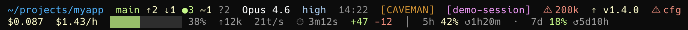

# ccstat for Claude Code

[](https://github.com/Nipeno/ccstat/actions/workflows/ci.yml)
[](LICENSE)
[](https://www.python.org/downloads/)
[](https://docs.anthropic.com/en/docs/claude-code)

Compact two-line statusline for [Claude Code](https://docs.anthropic.com/en/docs/claude-code) sessions.



*Demo screenshot — shows all segments and badges at once. Most sessions display a subset depending on your plan, git state, and active plugins.*

**Line 1 — identity:** directory · git branch + status · model · time · alerts  
**Line 2 — resources:** cost + $/hour · context bar · tokens · output speed · duration · lines changed · rate limits

---

## How it works

ccstat runs as a statusline hook — Claude Code calls `statusline.py` after each turn and displays whatever it prints. The script reads session data Claude Code already computed and passes as JSON via stdin. It makes no API calls, adds nothing to your prompt, and consumes zero tokens.

**Per-turn cost:** one Python process spawn (~20–50ms), one `git status` call, one cache file read. The daily update check is a fully detached background subprocess — it never blocks a turn.

**In short:** ccstat is invisible to Claude. It has no effect on your token usage, context window, or session cost.

<details>
<summary>Exactly what runs on your machine</summary>

- `statusline.py` — reads stdin JSON, runs `git status --porcelain -b`, formats and prints two lines. No network calls, no writes outside `~/.claude/`.
- Daily update check — a detached subprocess that fetches one line from `raw.githubusercontent.com` (HTTPS only) and writes a version string to `~/.claude/.ccstat-update-cache`. Runs at most once per day. Disable with `"update_check": false`.
- All file paths use `os.path.join` and are restricted to `~/.claude/`. No shell injection, no `eval()`, no user-supplied data executed.

Source: [`statusline.py`](statusline.py)

</details>

---

## Install

> **Windows users:** Python is not included with Windows. [Install Python 3.8+](https://www.python.org/downloads/) before continuing.

> [!WARNING]
> ccstat replaces any existing `statusLine` configured in `~/.claude/settings.json`. Your previous statusline config will be overwritten.

```bash
claude plugin marketplace add Nipeno/ccstat
claude plugin install ccstat@ccstat
```

Then run `/ccstat-setup` in any Claude Code session. Done.

This downloads `statusline.py`, configures `settings.json`, and verifies the install. Works on macOS, Linux, and Windows.

<details>
<summary>Alternative: install without the plugin marketplace</summary>

```bash
curl -fsSL https://raw.githubusercontent.com/Nipeno/ccstat/main/install.sh | bash
```

This installs the statusline only. Slash commands (`/ccstat-update`, `/ccstat-config`, etc.) require the plugin.

</details>

---

## Commands

| Command | Description |
|---------|-------------|
| `/ccstat-setup` | Set up or repair ccstat |
| `/ccstat-update` | Check for updates and apply with confirmation |
| `/ccstat-remove` | Remove ccstat and clean up settings |
| `/ccstat-info` | Show version, update status, and current config |
| `/ccstat-config` | View or change settings in `~/.claude/ccstat.json` |

---

## Configuration

Create `~/.claude/ccstat.json` to override defaults (all keys optional):

```json
{
  "bar_width": 12,
  "show_tok_speed": true,
  "show_lines_diff": true,
  "update_check": true,
  "badge_file": ".ccstat-badge",
  "badge_prefix": "",
  "badge_default_mode": "full"
}
```

| Key | Default | Description |
|-----|---------|-------------|
| `bar_width` | `12` | Width of the context bar in characters (4–40) |
| `show_tok_speed` | `true` | Show output token speed (t/s) |
| `show_lines_diff` | `true` | Show +lines / -lines diff |
| `update_check` | `true` | Daily background update check |
| `badge_file` | `.ccstat-badge` | Filename inside `~/.claude/` that plugins write badges to |
| `badge_prefix` | `""` | If set, file content is treated as a mode name and displayed as `[PREFIX:MODE]` |
| `badge_default_mode` | `"full"` | Mode value that omits the suffix (shown as `[PREFIX]` not `[PREFIX:FULL]`) |

Or just use `/ccstat-config` and Claude will handle it.

---

## What each segment shows

### Line 1

| Segment | Example | Notes |
|---------|---------|-------|
| Directory | `~/projects/myapp` | Home-shortened path |
| Git branch | `main` | Current branch |
| Git ahead/behind | `↑2 ↓1` | Commits ahead/behind upstream |
| Git status | `●3 ~1 ?2` | Staged · modified · untracked |
| Model | `Opus 4.6` | Active model (display name) |
| Effort | `high` | Shown if `effortLevel` set in settings |
| Time | `14:22` / `2:22 PM` | Local clock at last prompt — respects system locale (24h or 12h) |
| Plugin badge | `[CAVEMAN]` | Generic badge slot — any plugin can write to `~/.claude/.ccstat-badge` |
| Session name | `[my-session]` | Shown if session is named |
| Context warning | `⚠ 200k` | When context exceeds 200k tokens |
| Update badge | `↑ v1.3.3` | New version available — run `/ccstat-update` |

### Line 2

| Segment | Example | Notes |
|---------|---------|-------|
| Cost | `$0.042` | Session total. Gray on Pro (quota not depleted) |
| Cost/hour | `$1.23/h` | Burn rate |
| Context bar | `▓▓▓▓░░░░░░░░ 33%` | Green → yellow → red at 70% / 90% |
| Tokens this turn | `↑12k` | Input + cache tokens for current turn |
| Output speed | `18t/s` | Session average output tokens/sec |
| Duration | `⏱ 2m14s` | Total session wall time |
| Diff | `+47 -12` | Lines added/removed this session |
| Rate limits | `5h 42% ↺1h20m · 7d 18% ↺5d10h` | Pro plan 5h and 7d quotas + reset countdowns |

---

## Plugin badge system

ccstat has a generic badge slot on line 1. Any plugin that writes a single line to a file in `~/.claude/` can show a badge — ccstat reads it, no plugin-side changes needed.

**Example: caveman plugin**

The [caveman plugin](https://github.com/JuliusBrussee/caveman) writes its active mode to `~/.claude/.caveman-active`. Point ccstat at it via `ccstat.json`:

```json
{
  "badge_file": ".caveman-active",
  "badge_prefix": "CAVEMAN",
  "badge_default_mode": "full"
}
```

This displays `[CAVEMAN]` in full mode, `[CAVEMAN:LITE]` in lite mode, etc.

**Integrate your own plugin:** write one line to any file in `~/.claude/`, then set `badge_file` to that filename in `ccstat.json`.

---

## Requirements

- Python 3.8+
- Claude Code (any version with `statusLine` support)
- Git (optional — git segments skipped if not in a repo)

Works on macOS, Linux, and Windows. On Windows, install Python from [python.org](https://www.python.org/downloads/) first.

---

## License

[GNU General Public License v3.0](LICENSE)
